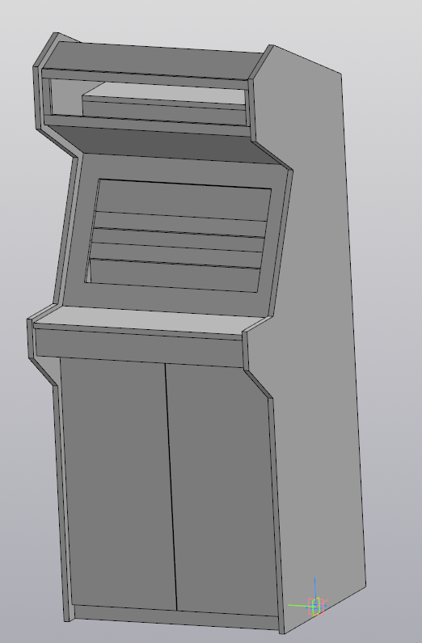

# ArcadeCabinet

The draws of Arcade machine plus Cabinet.

All draws are in Kompas 3d format.

You can use the kompas 3d viewer to view the draws: https://kompas.ru/kompas-3d-viewer/about/

# Mass-centering characteristics of the model

Weight 
>  M = 84130.720463 g
  
Area 
>  S = 24533094.406637 mm2
  
Volume 
>  V = 168261440.926995 mm3
  
Center mas                 
>  Xc = 26.242159 мм
>  
>  Yc = 346.868369 мм
>  
>  Zc = 809.525140 мм

